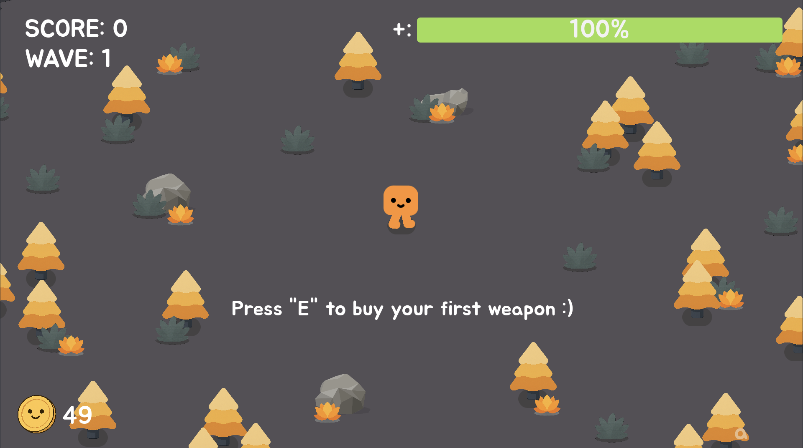

# Hariboo Madness — IB Computer Science IA

An arcade survivor game built with **Godot Engine** and **GDScript** as my IB Computer Science Internal Assessment.

The game evolved into [Hariboo Madness](https://apps.apple.com/es/app/hariboo/id6758705633), now available on the App Store for iPhone, iPad and Mac — rebuilt from scratch in Swift/SpriteKit.

## Structure

```
original/   ← The version submitted for the IA
rework/     ← Improved version after the assessment (same game, better code)
```

## About the game

- Top-down arcade survivor with infinite waves
- Local leaderboard
- Buy weapons and abilities
- Built entirely in Godot 4 with GDScript
- Music from [DOORS (Roblox)](https://www.roblox.com/games/6516141723) by LSPLASH

## Screenshots

<p align="center">
  
</p>

## Links

- [App Store (Swift version)](https://apps.apple.com/es/app/hariboo/id6758705633)
- [Website](https://beachlab.org/apps/hariboo/)
